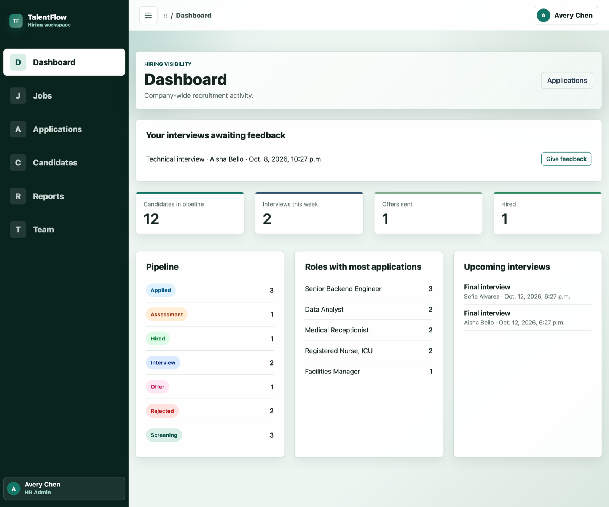
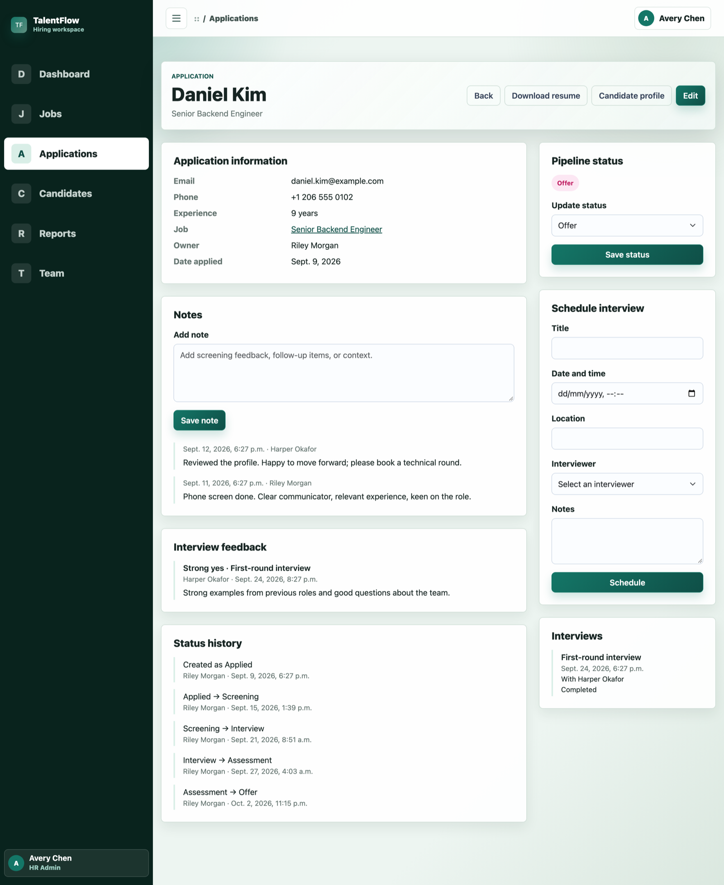
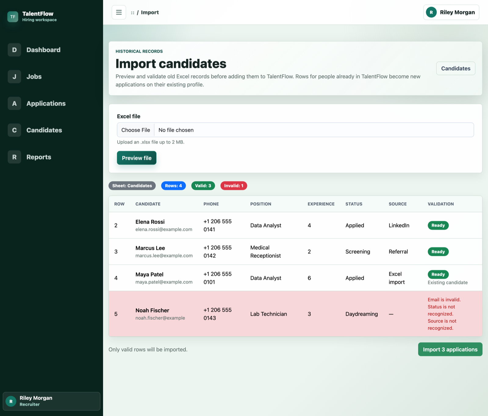
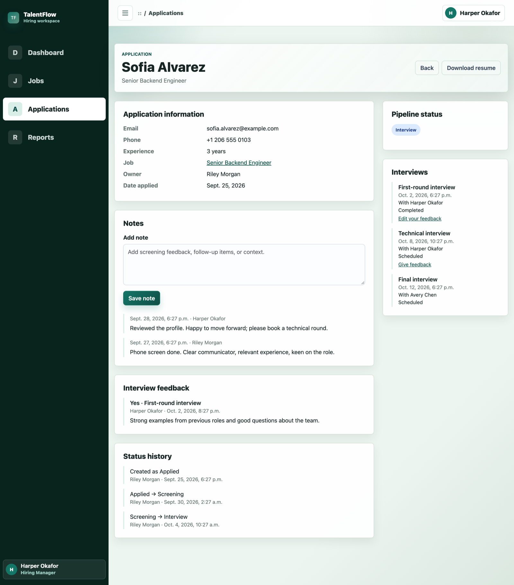

# TalentFlow

A multi-company applicant tracking system (ATS) built with Django and PostgreSQL. Each company gets a private hiring workspace where recruiters, hiring managers and HR admins manage jobs, candidates, applications, interviews and feedback.

**Live demo: [talentflow-ixq5.onrender.com](https://talentflow-ixq5.onrender.com)**

_Hosted on a free tier: the first load can take up to a minute while the app wakes up._


## Try the demo

Open the [login page](https://talentflow-ixq5.onrender.com/accounts/login/) and use one of the one-click buttons. No password needed:

| Button | What you can see and do |
| --- | --- |
| **Log in as Recruiter** | Applications assigned to you or unassigned; add candidates, move statuses, schedule interviews |
| **Log in as Hiring Manager** | Only applications for the jobs you manage (read-only), plus notes and your interview feedback |
| **Log in as HR Admin** | Everything in the company, the team page and every interviewer's feedback |

The demo company is fictional and the data may be reset. Demo accounts can't create invites, upload resumes or change account details.

## Features

- **Multi-company workspaces.** Sign-up creates a new company with you as HR Admin. Teammates join through expiring, single-use invite links.
- **Roles.** Recruiter, Hiring Manager and HR Admin, each with its own scope of data.
- **Candidates and applications.** One person can apply to many jobs. Each application has its own status, owner, notes, interviews and status history.
- **Hiring managers** are assigned per job and review only their own pipeline.
- **Interview feedback.** Interviewers submit a recommendation, but only see colleagues' feedback after submitting their own, so earlier opinions can't anchor theirs.
- **Status history.** Every status change records who made it, from which status, to which, and when.
- **Excel import** with a preview and row-level validation. It reuses existing people by email and matches positions to open jobs.
- **Private resume storage** with scoped downloads.
- **Dashboard and reports**, including by status, by role and by source.

## Architecture

```
config/        settings (environment-driven), URLs, env helpers
accounts/      companies, profiles, roles, invites, demo accounts
recruitment/   jobs, candidates, applications, notes, interviews, feedback, resumes
uploads/       Excel import (preview, then confirm)
dashboard/     role-aware summary
reports/       operational reports
tests/         pytest suite (factories in */factories.py)
```

**Selectors and services.** Views stay thin. Reads go through `selectors.py` and writes through `services.py`:
- **Selectors** return querysets that are already scoped to the user.
- **Services** wrap each write in `@transaction.atomic`, validate through a form, and record side effects such as status history in one place.

**Tenancy through scoped querysets.** There is no "remember to filter by company" in the views. Every read starts from a scope function in `recruitment/selectors.py`:
- `application_scope(user)` covers what you may **view**: your role's applications, plus any you're an interviewer on.
- `application_manage_scope(user)` covers what you may **change**, by role only. Every write view uses it, and so do the dashboards.
- `candidate_scope` and `candidate_resume_scope` cover people and resumes.

Anything outside your scope returns 404, so other companies' records can't even be confirmed to exist.

**Candidate vs Application.** A `Candidate` is the person, unique per company by case-insensitive email. An `Application` is that person applying to one job, and it owns the status, assigned recruiter, notes, interviews and feedback. The database enforces:
- one application per (candidate, job);
- for imported applications that have no job, one per (candidate, position text), using a conditional unique constraint, because `NULL` job values never compare as equal.

**Private resume storage.** Resumes use a dedicated `"resumes"` storage defined in `STORAGES`:
- **Locally:** a folder outside any public root.
- **In production:** a private Cloudflare R2 or S3 bucket, chosen purely by environment variables, with no code change or migration.
- **Downloads:** files are never served from a public URL. They're streamed through a view that applies `candidate_resume_scope`, sent as an attachment with `nosniff`.

## Security decisions

- **Integrity is enforced by the database, not just forms.** That covers case-insensitive unique company names and candidate emails, and unique applications. When two requests race past a form check, the losing `IntegrityError` is caught inside a savepoint and shown as a normal form error.
- **Invites:** random tokens, a 7-day expiry, and single use. The row is locked with `select_for_update` while an invite is being accepted, so two submits can't both use it.
- **Least privilege:**
  - Hiring Managers can't change status or edit applications.
  - Interviewers can read, but not change, the applications they interview on.
  - Recruiters can see everyone's basic details, but only download resumes for people whose applications they can access.
- **Resume uploads:** extension and size limits, a check that the file's content matches its extension, and random stored file names. A replaced file is deleted only after the database transaction commits.
- **Production settings:**
  - `DEBUG` defaults to off, and startup fails if `SECRET_KEY` is missing.
  - HTTPS redirect, secure cookies and HSTS (starting short).
  - `ALLOWED_HOSTS` and `CSRF_TRUSTED_ORIGINS` come from the environment.
  - `manage.py check --deploy` passes, and runs in CI.
- **Demo safety:** demo accounts have no usable password and aren't staff, and their usernames and company name are reserved. They can't create invites or upload resumes.

## Run locally

Requirements: Python 3.12+ and PostgreSQL.

```bash
git clone https://github.com/Hideehub/TalentFlow.git
cd TalentFlow
python3 -m venv .venv
source .venv/bin/activate
pip install -r requirements-dev.txt

cp .env.example .env          # then edit: SECRET_KEY, DEBUG=True, DB_* or DATABASE_URL
createdb talentflow_db

python manage.py migrate
python manage.py setup_roles
python manage.py seed_demo    # optional demo company; set DEMO_MODE=True for the login buttons
python manage.py runserver
```

To create one test account per role in your own company, run `python manage.py setup_test_users`. It prints a generated password, or you can pass `--password`.

## Run tests

```bash
pytest                 # needs a Postgres user that can create the test database
ruff check .
```

GitHub Actions runs ruff, a missing-migrations check, `check --deploy` and the full test suite against PostgreSQL 17 on every push and pull request.

## Deployment

The app is deployed on Render (`render.yaml`, `build.sh`) in the **Frankfurt** region. It uses Neon PostgreSQL through `DATABASE_URL` and Cloudflare R2 for resumes. Every environment variable is documented in `.env.example`.

- **Region:** create the Neon project in **AWS Europe Central 1 (Frankfurt)**, the same region as the Render service, so each database query doesn't cross continents.
- **Neon connection string:** use the **direct** one, not the pooled one. The app keeps database connections open (`conn_max_age`), which doesn't mix well with Neon's pooler.

## Screenshots

| Dashboard | Application with feedback and history |
| --- | --- |
|  |  |

| Excel import preview | Hiring manager view |
| --- | --- |
|  |  |
